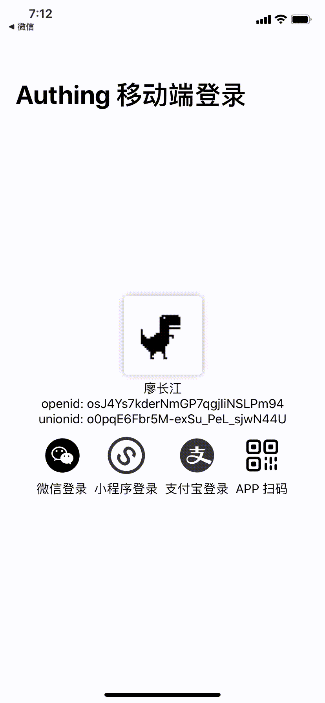
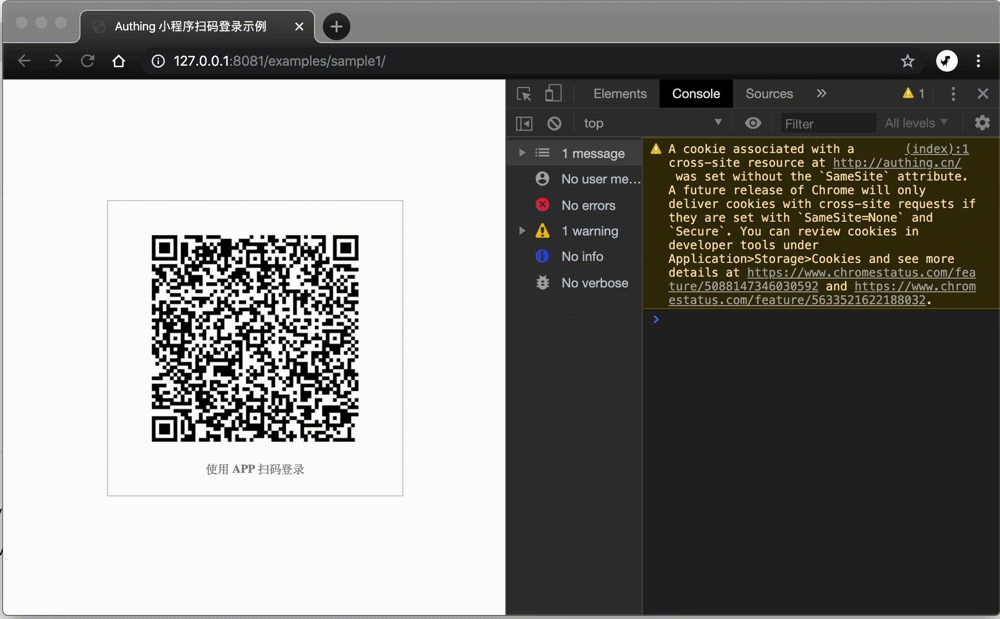

# APP 扫码登录


此登录方式提供 GitHub Demo ：[https://github.com/authing/AuthingIOSDemo](https://github.com/authing/AuthingIOSDemo)。


## 动图演示

移动端：

Web 端：

## 你可能需要 ...

1. 在 Web 端如何快速接入：



这篇文章会告诉你如何使用 **5 行代码**实现上述示例代码中的效果。

2. 了解 Web 端 SDK 的完整 API 列表：



3. 了解移动端需要用到的所有 API 列表



4. 了解有自定义配置项



5. 了解扫码登录原理



