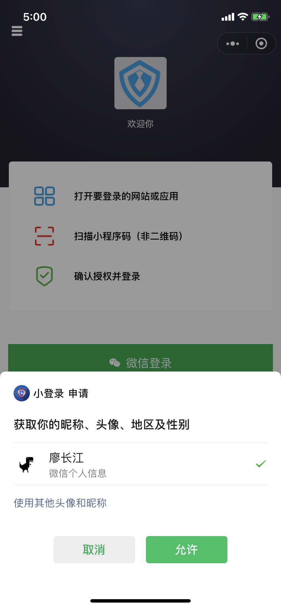

# 小程序登录


此文针对需要在小程序内**调用微信开放能力**实现**获取用户昵称头像**的开发者，如果你只是想在小程序 App 内使用 Authing 基础功能（如 register, login 等），可直接查看 [Authing SDK for 小程序](../../../sdk/authing-sdk-for-wxapp.md)。


如下所示：




## 准备工作

1. Authing 开发者账号
2. 申请微信小程序
3. 在 Authing 后台填入你的小程序信息

### 申请微信小程序

前往 [微信开放平台](https://mp.weixin.qq.com/) 按照指引注册微信小程序（如果需要获取用户手机号，需通过微信认证）。成功注册之后，前往**开发** - **开发设置**页面将以下两个域名加入服务器域名列表：

* `oauth.authing,cn` 
* `users.authing.cn` 


你可以在此页面获取到小程序的 AppId 和 AppSecret：


### 在 Authing 后台填入你的小程序信息

在微信公众平台创建完小程序之后，请按照下图指示在 Authing 控制台找到小程序社会化登录配置：


在此需要填入你的小程序应用信息：

* App ID
* App Secret


## 正式接入

### 初始化 Authing SDK

#### 下载代码

```text
git clone https://github.com/Authing/authing-wxapp-sdk
```

#### 引入文件

然后将 repo 内的 authing 文件夹移动到你的项目目录下，之后使用 require 引入

```javascript
var Authing = require('path/to/authing/authing.js')
```

#### 初始化

初始化小程序需要填入你的用户池 ID（userPoolId）：

```javascript
const authing = new Authing({
    userPoolId: 'YOUR_USERPOOLID'
});
```

### 获取微信授权 code

使用 `wx.login` 方法用于获取 `code`，此方法不需要经过用于授权。


每次调用 wx.login 都会刷新登录态，导致之前的 code 不可用，请谨慎操作。**Authing 不会主动调用 wx.login，需要开发者主动将 code 传给 Authing 服务器，所以请确保此 code 出于有效状态**。有关处理 code 的最佳实践，请见：[用户登录凭证（code）最佳实践](code-best-practice.md)。


### 获取用户信息

开发者需要引导用户点击[微信开放 button 组件](https://developers.weixin.qq.com/miniprogram/dev/component/button.html) （见open-type 的合法值章节），获取到点击事件 `e` 之后，将 `e.detail` 传给 `authing.loginWithWxapp` 方法即可。

```markup
<button open-type="getUserInfo" lang="zh_CN" bindgetuserinfo="onGotUserInfo">获取微信头像</button>
```

```javascript
// example.js
onGotUserInfo: function(e) {
    const self = this;

    // 微信 wx.login 返回的 code, 为了提高灵活性，开发者需要自己维护。
    // 调用 authing.loginWithWxapp()、authing.bindPhone() 的时候请确保 code 是可用的。
    const code = wx.getStorageSync("code")

    authing.loginWithWxapp(code, e.detail).then(userinfo => {
        console.log(userinfo)
        self.setData({
            userinfo: userinfo,
        })
    }).catch(err => {
        self.showDialog("操作失败", err)
    })
},
```

若用户之前同意过授权，不需要点击 `button` 就能直接获取，示例：

```javascript
const self = this;
// 查看是否授权
wx.getSetting({
    success(res) {
        if (res.authSetting['scope.userInfo']) {
            // 已经授权，可以直接调用 getUserInfo 获取头像昵称
            wx.getUserInfo({
                success: function(res) {
                    authing.loginWithWxapp(code, res).then(userinfo => {
                        console.log(userinfo)
                        self.setData({
                            userinfo: userinfo,
                        })
                    }).catch(err => {
                        self.showDialog("操作失败", err)
                    })
                }
            })
        }
    }
})
```

### 获取用户手机号（需通过微信认证）

开发者可以使用此接口让用户**绑定手机号**，但是不能用于通过手机号登录或注册新用户，如果想通过手机验证码登录，需要调用 [loginByPhoneCode](https://learn.authing.cn/authing/sdk/sdk-for-javascript#shi-yong-shou-ji-yan-zheng-ma-deng-lu) 方法。

每次获取微信用户的手机号必须用户主动点击开放组件 button，且无主动调用 API。

Authing 对换取用户手机号的协议进行了封装，开发者只需要引导用户点击微信开放 button 组件，获取到点击事件 e 之后，将 e.detail 传给 authing.bindPhone 方法即可。示例：

```markup
<button open-type="getPhoneNumber" bindgetphonenumber="bindPhone">绑定手机号</button>
```

```javascript
// example.js
bindPhone: function(e) {
    const self = this
    console.log(e)
    // 请确保这个 code 是最新可用的
    const code = wx.getStorageSync("code")
    authing.bindPhone(code, e.detail).then(function(userinfo) {
        console.log(userinfo)
        self.setData({
            userinfo: userinfo,
        })
    }).catch(function(err) {
        self.showDialog("操作失败", err.message)
    })
},
```

### 其他接口

请见：[Authing SDK for 微信小程序](../../../sdk/authing-sdk-for-wxapp.md)。

